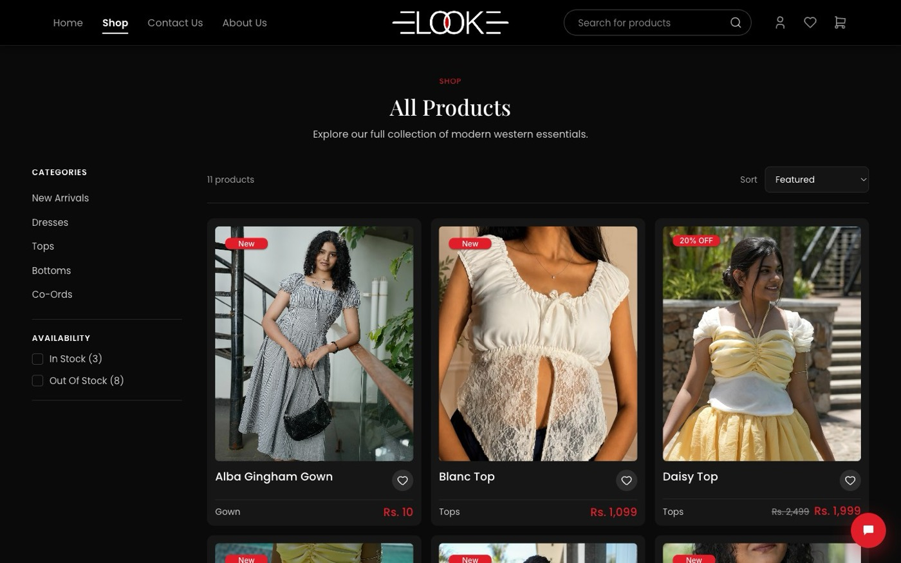
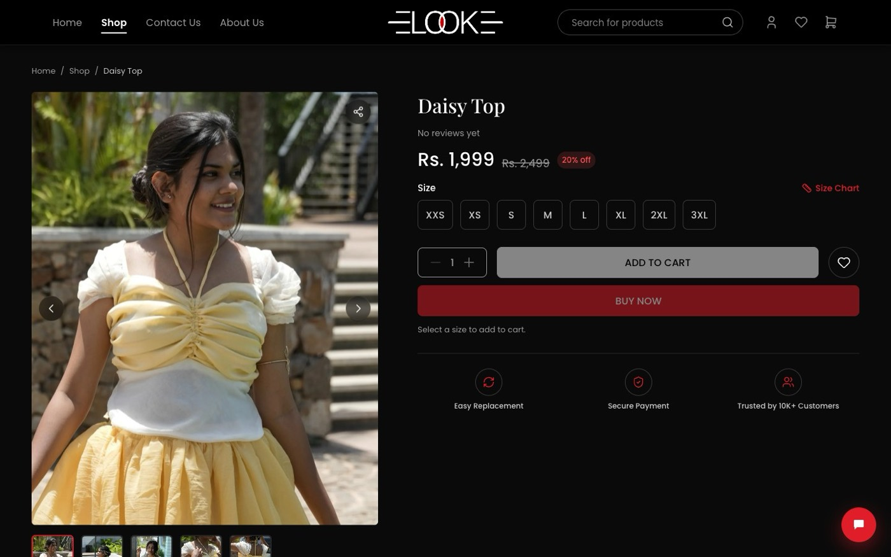

# LOOK

Headless storefront for [look.ind.in](https://look.ind.in) — a women's western-wear
label. React SPA on Vercel, Shopify as the backend, and a small serverless layer
for the things a public Storefront token can't do.


## What this is

The repo holds the **frontend and its backend-for-frontend, nothing else**. No
product data, prices, inventory, discounts, orders or customers are stored here —
those live in Shopify and arrive over the Storefront API at runtime. Checkout is
Shopify's hosted flow (Razorpay behind it), so there is no payment code here.

| Layer | Lives in | Talks to |
| --- | --- | --- |
| React SPA | `src/` | Storefront API (public token, shipped in the bundle) |
| Serverless BFF | `api/` | Customer Account API, Admin API, Resend, Delhivery |
| Edge middleware | `middleware.ts` | Storefront API, for crawler link previews only |

The split exists because secrets can't reach the browser. The Storefront token is
public by design and reads the catalogue; anything needing a client secret, an
Admin scope, or a customer's access token goes through `api/`, which keeps tokens
in signed, httpOnly cookies and never hands them to the SPA.

<table>
<tr>
<td width="50%"></td>
<td width="50%"></td>
</tr>
<tr>
<td><em>Shop. The filters, sort order and badges are all Shopify fields.</em></td>
<td><em>Product. Buy Now hands off to Shopify's hosted checkout.</em></td>
</tr>
</table>

## Running it

Node 20+. Three modes, each needing more setup than the last.

```sh
npm install
```

**1. Fixtures — no Shopify, no backend.** The whole UI renders against local
fixture data, so you can work on layout and motion with nothing configured.

```sh
npm run dev            # http://localhost:5173
```

**2. Live catalogue.** Copy `.env.example` to `.env` and fill in
`VITE_SHOPIFY_STORE_DOMAIN` + `VITE_SHOPIFY_STOREFRONT_TOKEN`. The moment both are
present, `src/lib/catalog.ts` swaps the fixtures for the real store. There is no
flag to set.

**3. Full stack, including `/api`.** Needs the server-only secrets from
`.env.example` as well.

```sh
npm run dev:local      # http://localhost:3000 — SPA + /api on one origin
```

Use `dev:local`, not `vercel dev`. `vercel dev` feeds `index.html` through Vite 6's
import analysis and errors out on this project's SPA rewrite;
`scripts/dev-local.mjs` runs Vite in middleware mode and dispatches `/api/*` to the
real handlers via `ssrLoadModule`. Same origin as production, so the BFF's
cookie and CSRF checks behave identically.

```sh
npm run build          # sitemap + tsc --noEmit + vite build
npm run lint
```

## Where things are

```
src/
  pages/            routes — home sections, shop, PDP, cart, account, /admin
  components/       layout, product, ui primitives, chat widget
  context/          cart, wishlist, user session, toasts
  lib/
    catalog.ts      the only catalogue import components may use
    cart.ts         same idea for the cart
    shopify/        Storefront API client, queries, transforms
    fixtures/       dev stand-ins behind the same interface
    customer/       Customer Account API client (via the BFF)
  config/site.ts    brand + contact details, single source of truth
api/
  auth/             OAuth login, callback, session, logout
  customer/         authenticated GraphQL proxy (orders, addresses, profile)
  account/          welcome email, marketing-consent toggle
  newsletter/       subscribe + unsubscribe
  admin/            password-gated campaign console
  cron/new-drop     daily new-product digest
  webhooks/         Delhivery scan → Shopify fulfillment event
  _lib/             shared: Shopify clients, cookies, tokens, email, rate limits
middleware.ts       per-product Open Graph tags for link crawlers
docs/               integration notes (start with shopify.md)
design-refs/        the original Figma exports
```

Two rules that are easy to break:

- **Components never import `lib/fixtures/*` or `lib/shopify/*` directly.** They
  import `lib/catalog.ts` or `CartContext`, which pick an implementation. That
  indirection is what makes mode 1 work.
- **Server secrets are never `VITE_`-prefixed.** Anything with the prefix is
  compiled into the browser bundle. `.env.example` marks which is which, per key.

## The serverless layer

Twelve functions, which is exactly Vercel's Hobby-plan ceiling. Adding a
thirteenth means merging two existing ones behind a rewrite — `vercel.json`
already does this for `/api/admin/*` and `/api/account/*`.

| Endpoint | Role |
| --- | --- |
| `auth/login`, `auth/callback`, `auth/session`, `auth/logout` | Passwordless OAuth 2.0 + PKCE against Shopify's Customer Account API. Tokens stay server-side. |
| `customer/graphql` | Proxies authenticated customer queries — orders, addresses, profile. |
| `cart/link` | Attaches the signed-in customer to their cart so checkout is account-aware. |
| `newsletter/subscribe`, `newsletter/unsubscribe` | Creates the customer (Admin API), sends the welcome mail, honours one-click unsubscribe. |
| `account` | First-sign-in welcome email, marketing-consent toggle. |
| `admin/console` | The owner's campaign console at `/admin`: compose, preview, test-send, send. |
| `cron/new-drop` | Daily at 05:00 UTC (10:30 IST) — emails newly published products, then tags them so a re-fire announces nothing twice. |
| `webhooks/delhivery` | Maps courier scans onto Shopify fulfillment events so the order tracker advances on its own. |

They fail closed: a missing secret makes the endpoint reject the request rather
than fall back to an unauthenticated path. The one deliberate exception is the
Resend sender, which logs to the console instead of sending when `RESEND_API_KEY`
is unset, so the email pipeline is testable without a key or a verified domain.

## Deployment

Vercel, from `main`. Worth knowing:

- **DNS.** The apex and `www` point at Vercel; `shop.look.ind.in` is Shopify's
  primary domain, which is what puts checkout on the brand. Never point the apex
  at Shopify — Shopify's domain onboarding will tell you to, and it takes the
  site down. `docs/shopify.md` has the records.
- **CSP.** `vercel.json` pins `connect-src` to the store's `myshopify.com` origin
  and blocks inline script. A new third-party origin needs adding there or the
  browser drops the request.
- **Sitemap.** Written from the live catalogue at build time, not per request —
  Vercel's edge strips `content-type` from HEAD responses on middleware paths,
  which Google's sitemap fetcher rejects. `scripts/register-product-webhooks.mjs`
  wires Shopify's product-create/delete events to a deploy hook so a new product
  triggers a rebuild by itself.

## Scripts

Only the first runs on its own. Three of the rest write to the live store, and
`backfill-marketing-consent` mails people who never ticked a box — its header
comment explains why it is a one-time decision rather than a routine job.

| Command | Purpose |
| --- | --- |
| `node scripts/generate-sitemap.mjs` | Write `public/sitemap.xml` from the live catalogue (runs on build) |
| `node scripts/extract-policies.mjs <returns\|shipping\|terms>` | Emit a policy page's HTML for pasting into Shopify, so both copies stay identical |
| `node scripts/register-product-webhooks.mjs [--list]` | Reconcile the Shopify → deploy-hook webhooks |
| `node scripts/backfill-marketing-consent.mjs` | One-off: subscribe existing account holders |
| `node scripts/delhivery-test-push.mjs` | Fire a synthetic courier scan at the webhook |

## Further reading

| Doc | Covers |
| --- | --- |
| [`.env.example`](.env.example) | Every environment variable: which are public, which are secrets, the Shopify scopes each needs, and the admin steps that have to happen before a key exists |
| [`docs/shopify.md`](docs/shopify.md) | Data flow, going live, the DNS records, the theme redirect, policy sync, transform assumptions |
| [`docs/delhivery.md`](docs/delhivery.md) | Courier webhook bridge and status mapping |
| [`docs/design-notes.md`](docs/design-notes.md) | Deliberate deviations from Figma, accessibility work, what is still fixture-backed |
